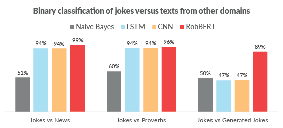

# Dutch Humor Detection by Generating Negative Examples


This project contains the algorithms used for the [*"Dutch Humor Detection by Generating Negative Examples"* project](https://arxiv.org/pdf/2010.13652.pdf) to create **humor detection datasets** by **generating non-jokes** from jokes.
We finetuned the **[RobBERT](/robbert)** Dutch language model, and found that it **outperforms previous neural models** like LSTMs and CNNs on this new dataset.
In doing so, we created the very **first Dutch humor detection systems**.



## New type of joke dataset

Many previous humor detection systems have learned to distinguish jokes from **completely different types** of text, e.g. news and proverbs.
Given that **jokes are fragile**, changing only a handful of important words, completely destroys the funniness of the joke.


### Dynamic Template algorithm

To generate non-jokes, we used our [dynamic template algorithm](https://github.com/twinters/dynamic-template).
This algorithm was already successfully in [TorfsBot](https://thomaswinters.be/torfsbot) Twitterbot which turns semi-philosophical texts into nonsensical tweets.
We used this algorithm here to **automatically break jokes** by replacing words with words from other jokes.

#### Dynamic Template Example

E.g., for the joke
> Two fish are in a tank. Says one to the other: "Do you know how to drive this thing?"

the funniness disappears if *"tank"* or *"fish"* or *"drive"* is replaced by almost any other word with the same part-of-speech.
Doing so turns the joke into an **absurd sentence**.

E.g. This algorithm could replace either of the important words of the previous joke by *"bar"* and/or *"men"* and/or *"drink"*, which might all occur in another joke used as context for the generated (non-)joke.

> Two men are in a bar. Says one to the other: "Do you know how to drink this thing?"

## Training neural models

We used this *"jokes versus generated jokes"* dataset to train several neural networks.
Similar to what other researchers showed, we also found that neural networks perform well for distinguishing jokes from news and proverbs.

However, as we suspected, CNN and LSTM models **completely fail to distinguish jokes from generated jokes**.
Our [RobBERT](/robbert) model is able to **distinguish jokes from these generated jokes ~90% of the time**.
This shows that such transformer models might have more grasp on humor, or at least on spotting some form of coherency.


You can read more details in [our paper](https://arxiv.org/abs/2010.13652), or in the [project page](https://thomaswinters.be/robbert-humor).


## Technical details

### Abstract
Detecting if a text is humorous is a hard task to do computationally, as it usually requires linguistic and common sense insights. In machine learning, humor detection is usually modelled as a binary classification task, trained to predict if the given text is a joke or another type of text. Rather than using completely different non-humorous texts, we propose using text generation algorithms for imitating the original joke dataset to increase the difficulty for the learning algorithm. We constructed several different joke and non-joke datasets to test the humor detection abilities of different language technologies. In particular, we test if the RobBERT language model is more capable than previous technologies for detecting humor when given generated similar non-jokes. In doing so, we create and compare the first Dutch humor detection systems. We found that RobBERT outperforms other algorithms, and especially shines when distinguishing jokes from the generated negative examples. This performance illustrates the usefulness of using text generation to create negative datasets for humor recognition, and also shows that transformer models are a large step forward in humor detection.

📄 Read the full paper [here »](https://arxiv.org/pdf/2010.13652.pdf)

### Code

This repository includes the experiments we performed for our [paper »](https://arxiv.org/pdf/2010.13652.pdf).

We have different features and multiple classifiers, which you can find in our `/src/` folder

#### Features
- [TF-IDF »](src/datasets/tfidf.py)
- [Huggingface tokenizers »](src/datasets/tokenized.py)
- [Word embeddings »](src/datasets/word_embeddings.py)

#### Classifiers
- [LSTM »](src/modules/lstm.py)
- [Fully connected »](src/modules/linear.py)
- [CNN »](src/modules/cnn.py)
- [RobBERT (barebones) »](src/modules/robbert.py) and [RobBERT (all features, other repo)  »︎]()


### Get started
The code in `src/datasources/` is used to scrape the data. See the corresponding files for each dataset.

There is also a script to prepare two scraped datasets for training a RobBERT model, you can use that script like this:

```shell script
python src/datasources/prepare_datsets.py data/processed/jokes.json data/processed/dynamic_template_jokes.json --mode classification 2> labels.txt 1> sentences.txt
```

The code in `src/` is to train the models. Run the training + evaluation code by running the entry point `run.py` in the root.

```shell script
pip install -r requirements.txt
python run.py
```


### Citing
```text
@inproceedings{winters2020humordetection,
  title={Dutch Humor Detection by Generating Negative Examples},
  author={Winters, Thomas and Delobelle, Pieter},
  booktitle={Proceedings of the 32st Benelux Conference on Artificial Intelligence (BNAIC 2020) and the 29th Belgian Dutch Conference on Machine Learning (Benelearn 2020)},
  year={2020}
}
```
